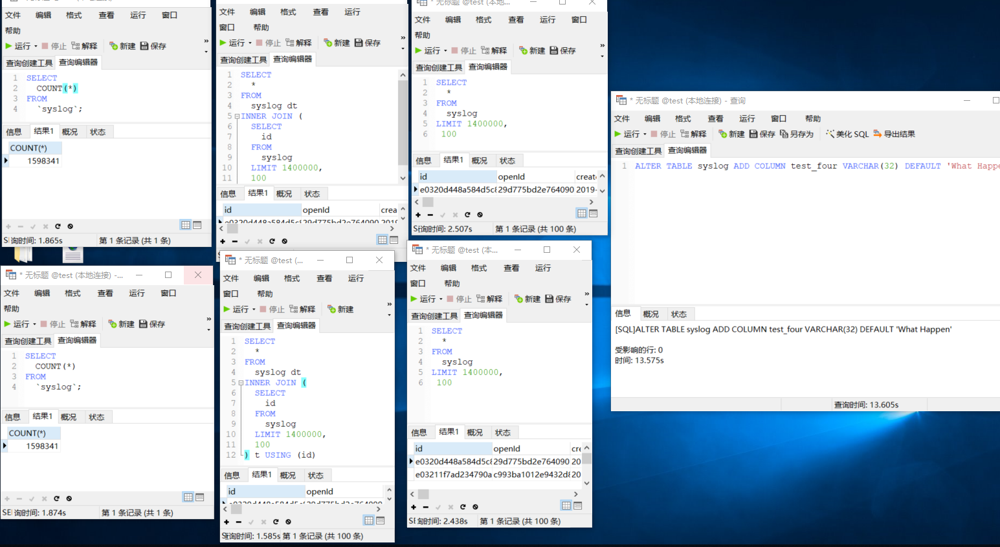
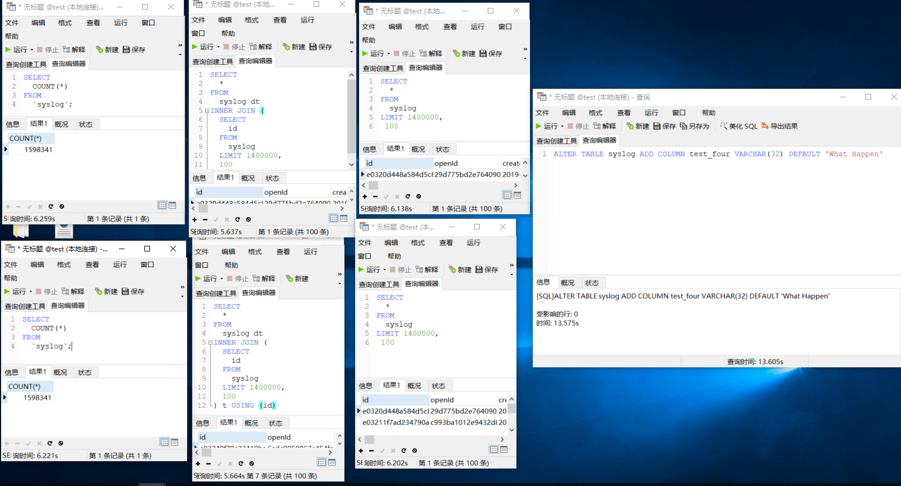

# OPTIMIZE TABLE

[Reference Document](https://dev.mysql.com/doc/refman/5.7/en/optimize-table.html)

## OPTIMIZE　TABLE 使用场景
> 批量插入几十万条数据后，查询速度明显变慢，执行OPTIMIZE TABLE 或 ALTER TABLE ADD COLUMN 语句后，查询速度明显变快
执行SQL前。
> ALTER　TABLE ADD COLUMN后 查询速度也会明显变慢， 执行OPTIMIZE TABLE后 查询速度会提升不少

#### 执行SQL前
- 
#### 执行SQL后
- 

#### 相关SQL
``` sql
-- CREATE TABLE
CREATE TABLE `syslog` (
  `id` varchar(32) NOT NULL COMMENT '主键',
  `openId` varchar(32) NOT NULL COMMENT '微信主键',
  `createDate` datetime DEFAULT NULL COMMENT '创建日期   需记录日期时间',
  `ip` varchar(50) DEFAULT NULL COMMENT '请求ip',
  `memo` longtext COMMENT '备注',
  `result` tinyint(1) NOT NULL DEFAULT '0' COMMENT '请求结果 0:失败 1:成功',
  `time` int(11) DEFAULT NULL COMMENT '请求时间',
  `url` varchar(100) DEFAULT NULL COMMENT '请求地址',
  `companyName` varchar(100) NOT NULL COMMENT '企业名',
  `version` varchar(20) DEFAULT NULL COMMENT '系统版本',
  `test_col_one` varchar(32) DEFAULT '1111111111111111111111',
  `test_col_two` varchar(32) DEFAULT '22222222222zzzzzzzzz',
  `test_col_three` varchar(32) DEFAULT '33333333333333333',
  `test_four` varchar(32) DEFAULT 'What Happen',
  PRIMARY KEY (`id`)
) ENGINE=InnoDB DEFAULT CHARSET=utf8 COMMENT='系统日志';
```
``` sql
SELECT COUNT(*) FROM `syslog`;
SELECT id FROM syslog LIMIT 1400000,100;
SELECT * FROM syslog LIMIT 1400000, 100;

ALTER TABLE syslog ADD COLUMN test_four VARCHAR(32) DEFAULT 'What Happen';

```
```
执行 OPTIMIZE TABLE syslog;
结果
Table	Op	Msg_type	Msg_text
test.syslog	optimize	note	Table does not support optimize, doing recreate + analyze instead
test.syslog	optimize	status	OK
```
#### Summary
```
alter table  add column 会和 OPTIMIZE TABLE 一样，
重新组织表数据和关联索引数据的物理存储，以减少存储空间并提高访问表时的I/O效率
```

## 优化表
使用OPTIMIZE TABLE语句优化表，但只能优化VARCHAR BOLB TEXT 类型字段
OPTIMIZE [LOCAL | NO_WRITE_TO_BINLOG] TABLE table01,table02;
```
notice: InnoDB 表可能会执行报错
解决：
ALTER TABLE table.name ENGINE='InnoDB';  -- 转移表数据，去掉碎片直接优化，不过会影响业务
或者
在启动的时候指定--skip-new或者--safe-mode选项来支持optimize功能
然后在执行OPTIMEZE
```